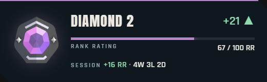

# Valorant Rank Tracker

Live Valorant rank overlays for OBS: current rank and RR, last-game change, session stats, match history and rank-up alerts.
The backend is Rust compiled to WebAssembly on **Cloudflare Workers** with one SQLite-backed Durable Object, so you can self-host it on the **free plan** with no server to run and no credit card.



- **Four transparent overlays:** rank card, recent games with per-match ACS and MVP badges, session (net RR, W/L/D, Elo chart) and full-screen alerts (rank up, derank, new peak, match result, win/loss streaks).
- **Per-match stats** from the v4 match data: ACS, ADR, headshot %, first bloods, and Match/Team MVP.
- **A dashboard** with live previews, an OBS URL builder, and admin controls (force refresh, session reset, test alerts).
- **Background refresh** once a minute while OBS is open. It stops by itself when nobody is watching, so no API calls are wasted.
- **Seven chat commands** for Nightbot or StreamElements (`!rank`, `!session`, `!lastgame`, `!peak`, `!winrate`, `!streak`, `!stats`), copyable from the dashboard.

Data comes from the unofficial [HenrikDev Valorant API](https://docs.henrikdev.xyz/) (v3 MMR, v2 MMR history, v4 match details). Tier icons, map and agent images come from [valorant-api.com](https://valorant-api.com/).

## Self-host it

### 1. Prerequisites

- [Node.js](https://nodejs.org/) 24+
- [Rust](https://rustup.rs/) with the Wasm target: `rustup target add wasm32-unknown-unknown`
- A free [Cloudflare account](https://dash.cloudflare.com/sign-up)
- A HenrikDev API key: open the [HenrikDev dashboard](https://api.henrikdev.xyz/dashboard/) → **API Keys** → **Generate New Key**

### 2. Clone and install

```sh
git clone https://github.com/Sajin-Saj/valorant-rank-tracker.git
cd valorant-rank-tracker
npm ci
```

On Windows PowerShell, use `npm.cmd`/`npx.cmd` if script execution policy blocks the `.ps1` launchers.

### 3. Set your Riot account

Edit the `[vars]` block in `wrangler.toml`:

```toml
RIOT_NAME = "YourName"   # the part before the #
RIOT_TAG = "1234"        # the part after the #
REGION = "ap"            # ap | eu | na | kr | latam | br
PLATFORM = "pc"          # pc | console
```

You can also change the Worker `name` at the top of the file; it becomes part of your URL.

### 4. Add your secrets

```sh
cp .dev.vars.example .dev.vars
```

Fill in `.dev.vars`:

- `HENRIK_API_KEY`: your HenrikDev key.
- `ADMIN_TOKEN`: a long random string that protects the admin controls. Generate one with
  `node -e "console.log(require('crypto').randomBytes(32).toString('base64url'))"`.
- `MOCK_MODE`: `true` plays a scripted preview (win → loss → rank-up → draw → derank) without calling HenrikDev; `false` tracks your real rank.

`.dev.vars` is gitignored. Never commit it, and never paste your key into a URL, the dashboard or a source file.

### 5. Run locally

```sh
npm run dev
```

Open **http://localhost:8787/dashboard/**. The first build installs the pinned `worker-build` 0.8.5 and downloads its Wasm tooling; later builds reuse it.
Enter your `ADMIN_TOKEN` in the dashboard's password field to use the controls (it's stored only in that browser).

### 6. Deploy to Cloudflare (free)

Set `MOCK_MODE=false` in `.dev.vars`, then:

```sh
npx wrangler login
npx wrangler deploy --secrets-file .dev.vars
```

Wrangler uploads the values from `.dev.vars` as encrypted Worker secrets, so no key goes into command arguments or `wrangler.toml`.
Alternatively, deploy and then run `npx wrangler secret put HENRIK_API_KEY` and `npx wrangler secret put ADMIN_TOKEN`.

Your tracker is now at `https://valorant-rank-tracker.<your-subdomain>.workers.dev` (dashboard at `/dashboard/`).
Local `wrangler dev` state and cloud state are separate. `npx wrangler tail` streams runtime logs; keys and tokens are never logged.

Keep your deployment URL to yourself (OBS and your bot only). The dashboard is public but its controls need the token; a flood of requests could use up your free daily quota.

## OBS sources

Create one **Browser Source** per overlay, using your host plus the path below:

| Source | URL path | Width × height |
|---|---|---|
| Rank card | `/overlay/rank-card` | 520 × 160 |
| Recent games | `/overlay/history` | 900 × 110 |
| Session | `/overlay/session` | 400 × 220 |
| Alerts | `/overlay/alerts` | 1920 × 1080 |

Or import `obs/rank-tracker-scene.json` (**Scene Collection → Import**) and replace `YOUR-SUBDOMAIN` in each browser source URL.

- Leave **Shutdown source when not visible** unchecked.
- Keep OBS's default transparent CSS.
- Set Page permissions to **Read access to OBS status information**, so overlays poll every 30 seconds while streaming or recording and every five minutes when idle.
- On network errors the overlays keep their last good data and never show error messages on stream.

The dashboard's URL builder creates source URLs and shows the right source size. Supported parameters:

```text
?scale=1.25&accent=tier&poll=30&count=5&layout=compact&sound=0
```

Scale `.25–3`; poll `5–300` seconds; count `5–10`; accent `tier` or a six-digit hex color (encode `#` as `%23`); layout `normal`/`compact`; sound `0`/`1`.
`/overlay/history?view=acts` shows past acts instead of games. When scaling, increase the OBS source dimensions by the same factor. Sound uses synthesized tones and depends on browser/OBS audio permissions.
Use extensionless paths; `.html` URLs redirect (parameters are preserved).

Immortal/Radiant show uncapped RR and leaderboard placement; Unranked has no bar. History marks derank protection with a shield and RR refunds with a chip. The session Elo chart includes tier boundary guides.
Alerts play each new event once. Reloading an overlay doesn't replay old events, and reopening OBS after a break doesn't replay games you played while it was closed.

## Refresh and sessions

State polls read cached data and extend a ten-minute watch window. A Durable Object alarm refreshes once per minute while watched, then stops. The first request resolves and caches your PUUID and loads state inline. `/api/rank.txt` also refreshes inline when the data is old, since bots call it rarely. Unchanged history only advances the checked timestamp. The tier table is cached for a day.

The first history import takes at most three games per alarm, oldest first; twenty past games take about six more alarm cycles. Games imported while catching up never trigger alerts. The current rank shows immediately; session counts settle when the import finishes (`meta.catching_up=false`). Sessions split after a gap longer than `SESSION_GAP_HOURS` (default 6). Net RR is current Elo minus starting Elo, so it stays correct across promotions and deranks. Manual reset starts a new session from the current Elo without deleting match history.

Streak alerts fire at 3, 5, 7 and 10 consecutive wins or losses; a draw ends a streak. Games imported before per-match stats existed get their stats filled in the background, one per quiet refresh, for the 10 most recent games.

Upstream failures keep the last state and back off for 60/120/300 seconds; a `Retry-After` header can extend that. Admin force refresh skips the freshness check but respects backoff and concurrent refreshes. A flood of public requests can't speed up upstream refreshes. Alarm handlers absorb upstream failures, so Cloudflare's automatic alarm retries don't bypass the backoff.

## API and bot commands

Public: `GET /api/state`, `GET /api/health`, `GET /api/rank.txt`, `GET /api/text/{rank|session|lastgame|peak|winrate|streak|stats}`.

Admin (with `Authorization: Bearer <ADMIN_TOKEN>`): `POST /api/admin/refresh`, `POST /api/admin/session/reset`, `POST /api/admin/test/{win|loss|draw|rank_up|derank|new_peak|win_streak|loss_streak}`.
Test endpoints add preview events without changing rank or session. If no admin token is configured, admin routes reject every request. API responses use `Cache-Control: no-store`.

Nightbot custom command `!rank`:

```text
$(urlfetch https://YOUR-WORKER.workers.dev/api/rank.txt)
```

StreamElements custom command:

```text
${urlfetch https://YOUR-WORKER.workers.dev/api/rank.txt}
```

A reply looks like `Gold 2 · 52 RR · -20 last game`. The dashboard's **Chat commands** section lists every command with a live preview and a copy button for either bot. Examples:

| Command | Reply |
|---|---|
| `!lastgame` | `Last game: Loss 11-13 on Ascent as Jett · 23/20/5 · 271 ACS · 29% HS · -20 RR · Team MVP` |
| `!session` | `Session: +16 RR · 4W 3L 0D` |
| `!winrate` | `Last 20: 11W 8L 1D · 55% win rate` |
| `!streak` | `On a 3-game win streak 🔥` |
| `!stats` | `Last 10 avg: 245 ACS · 150 ADR · 24% HS · 1.12 K/D` |

Chat routes refresh inline when the data is older than a minute.

## Free plan usage

Static files (overlays, fonts, dashboard) are free and don't count as requests. A heavy day (10 hours streaming with four overlays, plus 14 hours with OBS open) uses roughly 6–7% of the Workers Free plan's daily request limits. See [PLAN.md §10](PLAN.md) for the full budget. If a limit is ever reached, overlays keep their last good state until the daily reset at 00:00 UTC.

## Development

```sh
npm test                                   # core logic tests + client tests
cargo test -p api --lib
npm run check                              # rustfmt + clippy for the Wasm target
cargo build -p core --target wasm32-unknown-unknown
npm run build
npx playwright install chromium
npm run verify                             # full local runtime + browser verification
node scripts/verify-cloud.mjs https://valorant-rank-tracker.<your-subdomain>.workers.dev
```

`npm run verify` runs a real local workerd and checks auth, routes, assets, redirects, automatic alarms, browser overlays and alerts, SQLite persistence across restarts, and watch expiry. It uses accelerated timers (production keeps 60/600 seconds) and port 8788, and saves screenshots to the ignored `artifacts/` folder.
`verify-cloud.mjs` watches the real minute alarm on a deployment until the history import completes, then checks browser rendering and an injected win alert. Run it with local `wrangler dev` stopped.

`npm run capture` saves real HenrikDev responses for the account in `wrangler.toml` to `crates/core/tests/fixtures/real/`. Synthetic schema fixtures live next to it and are labeled separately. `scripts/assets.ps1` refreshes the public tier table and the self-hosted Anton/Rajdhani fonts.

**Architecture:** `crates/core` is pure logic with no I/O or clock reads; `crates/api` holds the Worker and Durable Object glue. Static assets are served before the Worker. The Worker forwards `/api/*` to a single named `Tracker` Durable Object, where JSON parsing, session math, storage and alarms run. The design notes are in [PLAN.md](PLAN.md).

## Troubleshooting

- **No rank / HTTP 503:** check `/api/health` for configured/mode/backoff, and confirm your key and Riot ID. The first refresh needs network access. Never post your key when sharing logs.
- **401 on admin controls:** use the exact `ADMIN_TOKEN` value, without dotenv quotes or comments. The saved token is per host and port, so enter it again after switching from localhost to your workers.dev URL.
- **Stale data:** check the backoff and alarm timestamps in the dashboard. HenrikDev can lag a finished game by several minutes. Background refresh stops when the watch window expires and resumes on the next poll.
- **Build loops:** Wrangler must watch source and fixture paths only; `crates/api/build/` must not be in `watch_dir`.
- **Wasm externref build error:** keep `strip = "debuginfo"`; full symbol stripping breaks wasm-bindgen catch wrappers. The `worker` crates and wasm-bindgen are pinned as a compatible family.
- **Wrong OBS size:** use the URL builder's dimensions, account for `scale`, and use extensionless paths.
- **Blank alerts:** expected until a new event arrives. Send a test event from the dashboard; old and catch-up events intentionally don't animate.

## License and credits

[MIT](LICENSE) © 2026 Sajin Sajeev.

- Fonts: [Anton](public/fonts/anton-LICENSE.txt) and [Rajdhani](public/fonts/rajdhani-LICENSE.txt), SIL Open Font License, self-hosted.
- Data: [HenrikDev API](https://docs.henrikdev.xyz/) (unofficial; follow its terms and rate limits) and [valorant-api.com](https://valorant-api.com/).

Valorant Rank Tracker isn't endorsed by Riot Games and doesn't reflect the views or opinions of Riot Games or anyone officially involved in producing or managing Riot Games properties. Riot Games and all associated properties are trademarks or registered trademarks of Riot Games, Inc.
